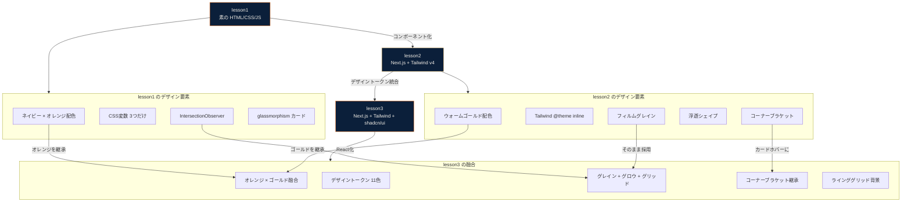
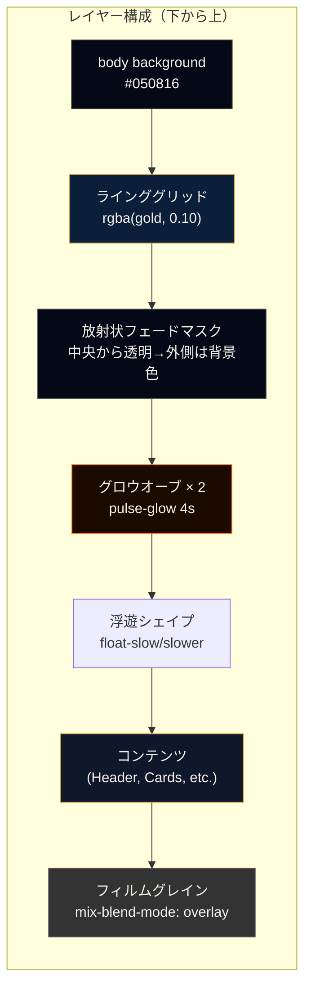

# デザインシステムの進化: lesson1 → lesson2 → lesson3

## 概要

3つのレッスンを通じて、デザインの考え方がどう進化したかの記録。

## デザインシステムの進化フロー



## CSS設計の進化

```mermaid
graph LR
    subgraph L1["lesson1: 手書きCSS"]
        A1["style.css 426行"]
        A2["CSS変数 3つ"]
        A3["@media + !important"]
    end

    subgraph L2["lesson2: Tailwind v4"]
        B1["globals.css @theme"]
        B2["ユーティリティクラス"]
        B3["レスポンシブ prefix"]
    end

    subgraph L3["lesson3: Tailwind + shadcn"]
        C1["デザイントークン統合"]
        C2["cn() でクラス合成"]
        C3["コンポーネント単位の管理"]
    end

    L1 --> L2 --> L3

    style L1 fill:#1a0505,stroke:#f97316,color:#f5f0e8
    style L2 fill:#0a0a1a,stroke:#d4a853,color:#f5f0e8
    style L3 fill:#050816,stroke:#d4a853,color:#f5f0e8
```



### 修正前後の比較

**lesson1: CSS変数の定義（3つだけ）**
```css
:root {
    --color-navy: #0b1f3a;
    --color-orange: #f59e0b;
    --white: #ffffff;
}
```

**lesson3: デザイントークン（体系的な11色 + フォント）**
```css
@theme inline {
    --color-bg: #050816;
    --color-surface: rgba(15, 23, 42, 0.5);
    --color-surface-solid: #0f172a;
    --color-line: rgba(212, 168, 83, 0.1);
    --color-line-hover: rgba(212, 168, 83, 0.25);
    --color-ink: #f5f0e8;
    --color-ink2: rgba(245, 240, 232, 0.7);
    --color-ink3: rgba(245, 240, 232, 0.35);
    --color-accent: #f97316;
    --color-accent2: #d4a853;
    --color-navy: #0b1f3a;
    --font-sans: "DM Sans", sans-serif;
    --font-mono: "DM Mono", monospace;
}
```

**技術的背景:**
デザイントークンは「色の名前」ではなく「役割の名前」で定義するのがプロの標準。`--color-orange` ではなく `--color-accent` と命名することで、配色変更時にトークン名を変えずに値だけ変更できる。今回まさに lesson1 のオレンジから lesson2 のゴールドへの融合が、トークン名を変えずに実現できた。

## 背景アニメーションの層構造



**ポイント:**
- BackgroundDecor は `-z-10` でコンテンツの後ろに配置
- フィルムグレインは `z-index: 9999` で最前面だが `pointer-events: none` + `mix-blend-mode: overlay` でコンテンツを邪魔しない
- 格子線は放射状フェードマスクで中央付近だけ見せることで、うるさくならずにテック感を演出

## トレードオフ

### アニメーションの量

| 方針 | メリット | デメリット |
|---|---|---|
| 控えめ（グロウのみ） | 軽量、上品 | 平凡に見える |
| **中程度（採用: グロウ + シェイプ + グリッド）** | **世界観が出る、lesson2との連続性** | **初回描画に少し負荷** |
| 過剰（パーティクル等） | 派手でインパクト | パフォーマンス問題、目が疲れる |

## 初心者向けチェックリスト

- [ ] `mix-blend-mode: overlay` はテクスチャ合成に便利。要素を半透明にしなくても下の色と混ざる
- [ ] CSS アニメーションの `steps()` はフィルムグレインのようなカクカクした動きに最適
- [ ] `position: fixed` の要素は他の fixed 要素と z-index が競合しやすい。明示的に管理する
- [ ] 背景パターンは `radial-gradient` マスクで中央からフェードさせると上品に見える
- [ ] アニメーションの `animation-delay` をずらすと、複数要素が同期せず自然に見える

## 今後の課題

- **prefers-reduced-motion 対応**: BackgroundDecor 内のアニメーションも `@media (prefers-reduced-motion: reduce)` で停止させる
- **モバイルパフォーマンス**: blur や backdrop-filter はモバイルGPUに負荷がかかる。低スペック端末での検証が必要
- **デザイントークンの文書化**: 配色の意図やルールを Storybook 等で可視化する
