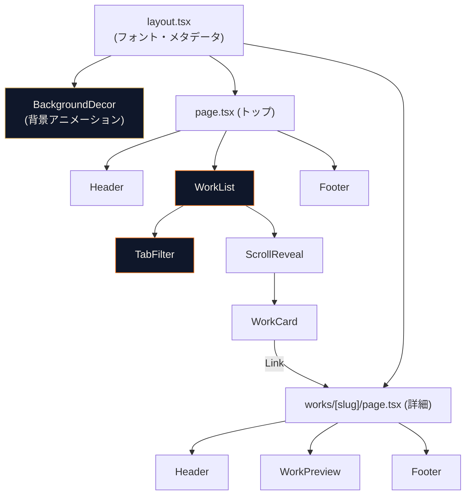
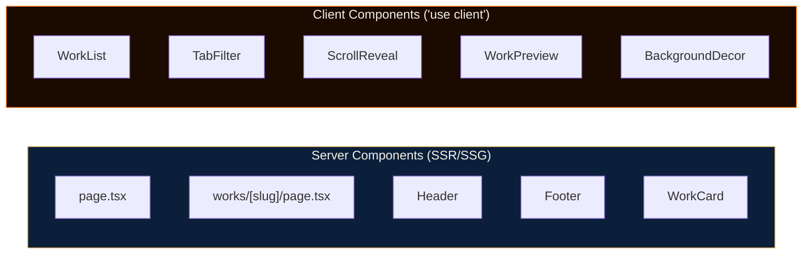
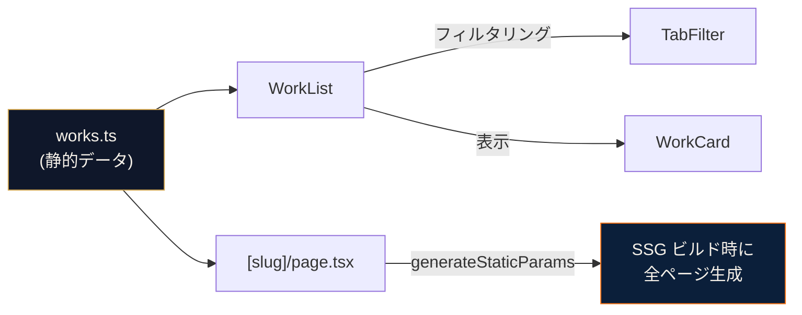

# Portfolio v2 アーキテクチャと設計判断

## 概要

team-f-cc-lab.vercel.app をベースに、lesson1/lesson2 の世界観を融合したポートフォリオサイトを Next.js + Tailwind CSS + shadcn/ui で構築した。

## コンポーネント構成



### Server Component vs Client Component の使い分け



**判断基準:**
- `useState` / `useEffect` / ブラウザAPI（IntersectionObserver, ResizeObserver）を使う → Client Component
- それ以外 → Server Component（デフォルト）

## データフロー



**なぜ DB を使わないか:**
- 作品数が少ない（2件）→ TypeScript 配列で十分
- SSG（静的サイト生成）で高速配信可能
- DB を入れるとホスティングコストと複雑さが増す

## 修正前後の比較

### カードの存在感の出し方

**修正前（初期実装）:**
```css
/* 枠線を目立たせる方式 */
border: 1px solid rgba(212, 168, 83, 0.25);
```

**修正後（トレンド準拠）:**
```css
/* 背景色の差 + shadow で浮かせる方式 */
border: 1px solid rgba(212, 168, 83, 0.1);  /* 枠線はほぼ透明 */
background: rgba(15, 23, 42, 0.5);           /* 背景を少し明るく */
box-shadow: 0 8px 40px rgba(0,0,0,0.6);     /* 影で存在感 */
```

**技術的背景:**
Vercel, Linear, Raycast など 2025-26年のモダンダークUIでは、カードの境界を枠線ではなく背景色の差 + shadow で表現するのが主流。枠線を目立たせると「2020年代前半のグラスモーフィズム」感が出やすい。

### テキストコントラスト

**修正前:**
```css
--color-ink2: rgba(245, 240, 232, 0.5);  /* 読みづらい */
--color-ink3: rgba(245, 240, 232, 0.2);  /* ほぼ見えない */
```

**修正後:**
```css
--color-ink2: rgba(245, 240, 232, 0.7);  /* しっかり読める */
--color-ink3: rgba(245, 240, 232, 0.35); /* 存在が分かる */
```

**技術的背景:**
WCAG のコントラスト比ガイドラインでは、本文テキストは最低 4.5:1 が推奨。ダークテーマでの半透明テキストは実際のコントラスト比を確認しないと読みづらくなりがち。雰囲気を保ちつつ読みやすさを確保するバランスが重要。

## トレードオフ

### デザインアプローチの比較

| アプローチ | メリット | デメリット |
|---|---|---|
| A. 忠実クローン | クローン精度をアピール | 個性が出ない |
| **B. ハイブリッド（採用）** | **クローン力 + オリジナリティ** | **実装がやや複雑** |
| C. 完全オリジナル | デザイン力アピール | クローンスキルが見えない |

### 配色の比較

| 配色 | メリット | デメリット |
|---|---|---|
| B1. ゴールド全振り | lesson2 との統一感 | オレンジの個性が消える |
| **B2. オレンジ × ゴールド融合（採用）** | **lesson1 と lesson2 の両方を継承** | **色数が増えて調整が難しい** |
| B3. シネマティック | 映画的な美しさ | team-f-cc-lab とは異なりすぎる |

### 背景パターンの比較

| パターン | メリット | デメリット |
|---|---|---|
| ドットグリッド | 最もミニマル | やや平凡 |
| **ラインググリッド（採用）** | **テック感 + 読みやすい** | **個性は控えめ** |
| トポグラフィー | 個性的・ストーリー性 | 好みが分かれる |

## 初心者向けチェックリスト

- [ ] `"use client"` は useState / useEffect / ブラウザAPI を使うコンポーネントにだけ付ける
- [ ] Next.js 16 では `params` は Promise → 必ず `await params` する
- [ ] Tailwind CSS v4 では `tailwind.config.js` は不要 → `globals.css` の `@theme inline` で設定
- [ ] ダークテーマの半透明テキストは実際にブラウザで読みやすさを確認する
- [ ] 背景装飾は `position: fixed` + `-z-10` でコンテンツの後ろに配置
- [ ] iframe の `pointer-events: none` を忘れるとプレビューがクリックを奪う
- [ ] `generateStaticParams` を使えば動的ルートもビルド時に静的生成できる

## 今後の課題

- **OGP 画像の設定**: SNS シェア時のサムネイル画像を設定する
- **サムネイル画像**: placeholder グラデーションを実際のスクリーンショットに差し替え
- **アクセシビリティ**: キーボードナビゲーション、スクリーンリーダー対応の検証
- **パフォーマンス**: Lighthouse スコアの計測と改善
- **作品追加**: lesson3 自体やその他の制作物をカードとして追加
- **レスポンシブ微調整**: 様々なデバイスでの表示確認
